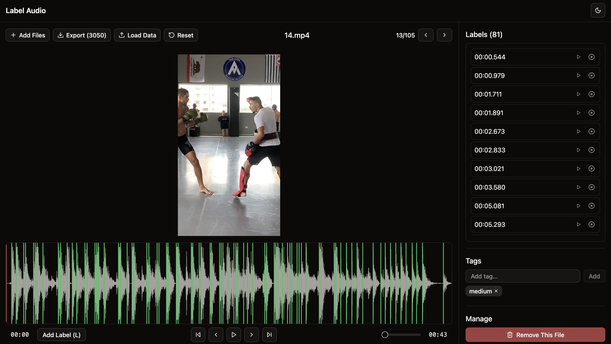

# Audio Label

A simple mostly vibe coded audio labeling application built with React. Upload audio files, navigate through them, and add labels with timestamps.
Everything gets saved locally in the browser so nothing gets lost. You can export to CSV after.

